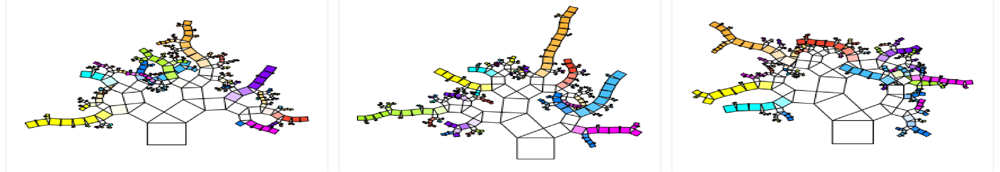
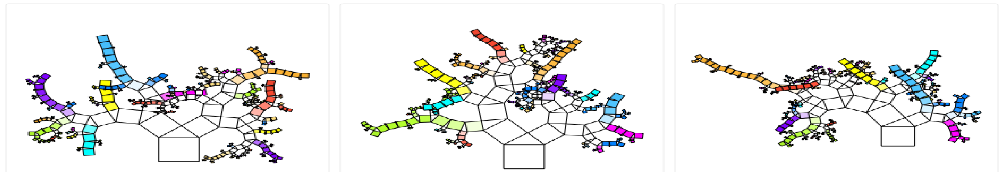

# [LASSO, Ridge, Elastic Net y Random Forest](https://github.com/MMiranda777/Machine-Learning/tree/main/LASSO%2C%20Ridge%2C%20Elastic%20Net%20y%20Random%20Forest)
_**Model Selection and Regularization**_

## - Programación:
## - Resultados:

