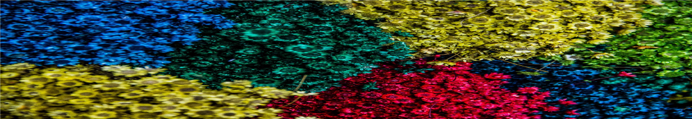

# [PCA & Cluster Analysis](https://github.com/MMiranda777/Machine-Learning/tree/main/PCA%20%26%20Cluster%20Analysis)
 _**Unsupervised Learning**_

El objetivo de esta entrega es poner en práctica algoritmos de **aprendizaje no supervisado** en diversas bases de datos e identificar sus características y diferencias.

  1. `(Ej 8 y 9)` La base **USArrest** está incluida en las bases de datos de _`RStudio`_, esta base contiene estadísticas de los arrestos por cada 100,000 habitantes por los cargos de asalto, homicidio y violación en cada uno de los _50_ estados de EE.UU en 1973. También incluye el porcentaje de la población que vive en áreas urbanas.
  2. `(Ej 10)` Muestra normal aleatoria de _60_ observaciones clasificadas en _3_ grupos (_20_ obs. c/u).
  3. `(Ej 11)` La base [**Ch10Ex11.csv**](https://github.com/MMiranda777/Machine-Learning/blob/main/PCA%20%26%20Cluster%20Analysis/Ch10Ex11.csv) consiste en una muestra de _40_ pañuelos con muestras de _1,000_ genes. Los primeros _20_ pañuelos son de personas saludables mientras que los últimos _20_ son de personas enfermas.

> _**NOTA**_ : Los ejercicios desarrollados se refieren a los ejercicios _8-11_ del capítulo _10 Unsupervized Learning, de James, G., Witten, D., Hastie, T., Tibshirani, R. (2013). An Introduction to Statistical Learning. With applications in R, Springer, ISL_. Todas las especificaciones relacionadas al código y los resultados vienen explicados a detalle en el documento [`PCA&ClusterAnalysis.pdf`](https://github.com/MMiranda777/Machine-Learning/blob/main/PCA%20%26%20Cluster%20Analysis/PCA%26ClusterAnalysis.pdf)

## - Programación:

Para este trabajo se ocuparon las siguientes funciones de la paquetería _`stats`_ en `RStudio`:

|   Función  |                                                                              Descripción                                                                             |
|:----------:|:--------------------------------------------------------------------------------------------------------------------------------------------------------------------:|
| `prcomp()` |   Realiza **PCA** sobre los datos y es posible extraer la _proportion  of variance explained_ (PVE) de cada componente así como sus eigenvalores y eigenvectores.    |
| `hclust()` | Realiza un análisis de **Hierarchical Clustering** sobre los datos  y es posible escoger el método de aglomeración  `(Complete linkage, Euclidian distance, etc...)` |
| `cutree()` |                          Corta árboles de decisión (un _hclust_ por ejemplo) especificando el número de grupos (k) o la altura deseada (h).                          |
| `kmeans()` |                                                  Realiza clusters por el método de **K-means** especificando la _k_                                                  |

El código completo puede consultarse en el archivo [`PCA&ClusterAnalysis_code.Rmd`](https://github.com/MMiranda777/Machine-Learning/blob/main/PCA%20%26%20Cluster%20Analysis/PCA%26ClusterAnalysis_code.Rmd) .

## - Resultados: 
   - `(Ej 9)` Se hicieron dos _H-Cluster_, uno con los datos 'crudos' y otro con los datos normalizados. Al trabajar de esta manera, concluimos que es mejor trabajar con los datos estandarizados porque las variables no siempre vienen en la misma escala y esto puede sesgar el modelo.
   - `(Ej 10)` Se realizaron varios _K-Cluster_ variando la _k_ (que originalmente era 3) y estandarizando los datos en un caso, donde pudimos comparar los modelos y sus resultados.
   - `(Ej 11)` Se observó que los modelos de _H-Cluster_ varían dependiendo del método de aglomeración que se use y que la mejor manera de obtener qué genes diferenciaban a las personas sanas de las enfermas era a através de un análisis de PCA.

----------------------------------------------------------------

